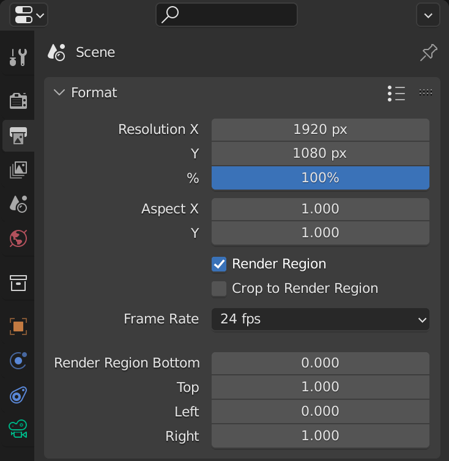

# VF Numerical Render Region

Adds numerical input fields for more precise control over Blender's Render Region.

## Installation and Usage

- Download the appropriate .py add-on file (available for both 2.90 and 3.0 series)
- Install and enable in the Blender Preferences Add-on tab
- Whenever Render Region is enabled, four numerical fields will appear at the bottom of the Output Settings Format panel (Dimensions panel in 2.90)
- `Bottom`, `Top`, `Left`, and `Right` are all 0.0-1.0 numerical values relative to the total width and height of the render (leaving `Bottom` at 0.0 and changing `Top` to 0.5, for example, will render only the lower half of the image).

There are no further settings or preferences, this is just a super simple add-on to make adjusting the render region more precise and controllable by revealing the native numerical settings. Perhaps helpful for rendering small patches in an animation or segmenting an exceptionally high resolution render.

Note that some render engines, such as Radeon ProRender, may not implement render regions reliably and will result in multi-pixel shifts that don't align as expected (this error may be worse/better depending on how the resolution divides by the region percentage).